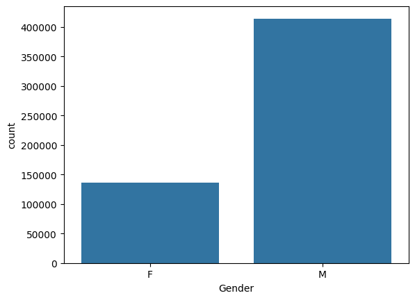
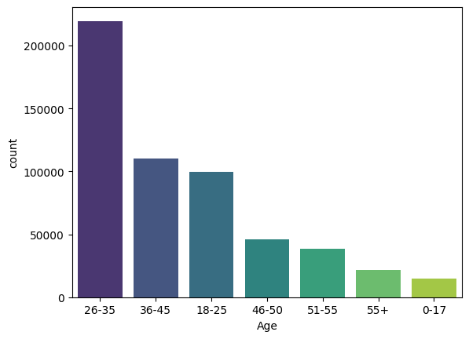
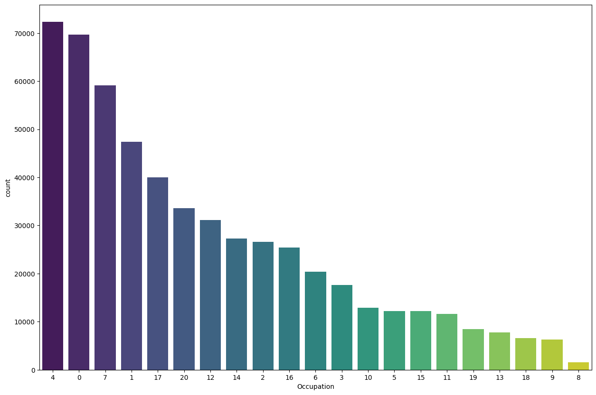
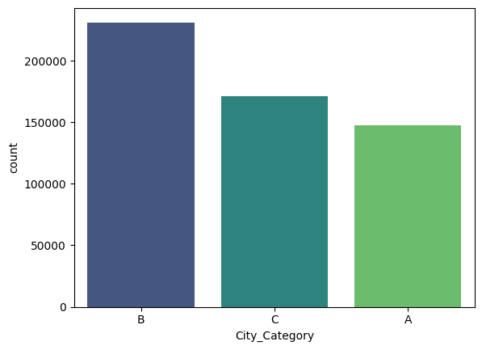
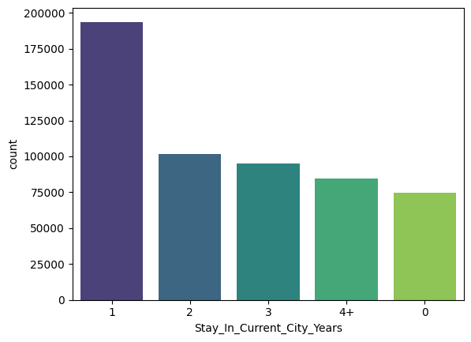
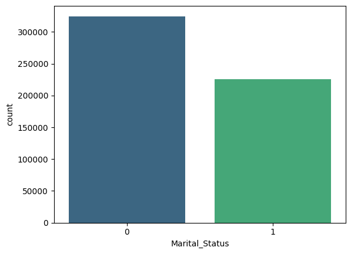
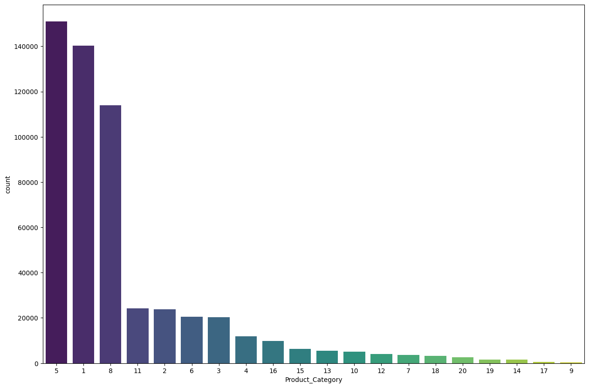

# Ecommerce Walmart Sales Analysis

In this new episode of the series we are analysing the Ecommerce Walmart Sales Dataset. The link is below

[https://www.kaggle.com/datasets/devarajv88/walmart-sales-dataset]()

This analysis promise to be very interesting as we'll be unfolding a lot about this dataset and coming to a very good conclusion. 

To get started, we'll start with ***Data Understanding***. This is very important, it helps building the right intuition into the dataset. 

But befor we jump into that we should check our Data Info..

## Data Information (Description)

- Walmart is a globally recognized retail giant, renowned for offering a wide range of products at competitive prices, and providing a convenient shopping experience for millions of customers worldwide.
- Analyzing this dataset offers valuable insights into Walmart's customer base and purchasing behavior. It reveals details about customer demographics, product preferences, and spending patterns. This comprehensive dataset is a valuable resource for understanding various aspects of Walmart's operations, such as marketing strategies, customer segmentation, and product demand. It can enhance strategic decision-making in areas like inventory management, targeted marketing, and customer relationship management.

### The datset contains the following columns:

- User_ID: User ID
- Product_ID: Product ID
- Gender: Sex of User
- Age: Age in bins
- Occupation: Occupation(Masked)
- City_Category: Category of the City (A,B,C)
- StayInCurrentCityYears: Number of years stay in current city
- Marital_Status: Marital Status
- ProductCategory: Product Category (Masked)
- Purchase: Purchase Amount

### Potential Usecases

- Customer Segmentation
- Market Basket Analysis
- Personalized Marketing
- Demand Forecasting
- Product Recommendation Systems
- Customer Lifetime Value (CLV) Analysis
- Sales and Revenue Analysis
- Urban vs. Rural Analysis
- Occupational Influence on Purchases
- Customer Loyalty Programs
- Marital Status and Shopping Behavior
- Price Sensitivity Analysis
- Optimizing pricing strategies to maximize sales and profitability

## Data Understanding:

Data Understanding is as a result of ***Data Exploration,* *Univariate Data Analysis***, and ***Domain Knowledge*** from the ***Data Description.***

* We have 550068 records.
* We have 5891 users
* We have 3631 products

* Major Data types are int64 and object
* No missing values

* No Duplicated row in the dataset
* We have more Males visiting Walmart store compared to females. The data consists of 75.3% of Males and 24.7% of Females.

* A lot of the customes visiting the store are Middle Age - We have 40% of the customers in the Age group of 26-35, 20% for 36-45, and 18.1% for 18-25. This means that 78% of the customers are youths.
* The Occupation groups 4, 0 and 7 appears to have a lot of customers in that category.

* A lot of the customers are from City B and C. Maybe that's because it's closer to the store (we don't know their exact locations)
* Customers that have spend a year in a city tends to get used to the store in that city. While those that have stayed longer seems to be losing interest. This is worth an investigation.
* Assuming Marital Status of 0 means single, then well say that walmart sales attracts more singles than married (to an extent though).
* Product Category 5, 1 and 8 seems to be very popular amongst customers since they appear to have high appearance in the data. Though this should still be boiled down to the product ID that contributes best.

## Plots from Univariate Analysis

* Gender

    

* Age

  
* Occupation

  
* City_Category

  
* Stay_In_Current_City_Years

  
* Marital_Status

  
* Product_Category

    
